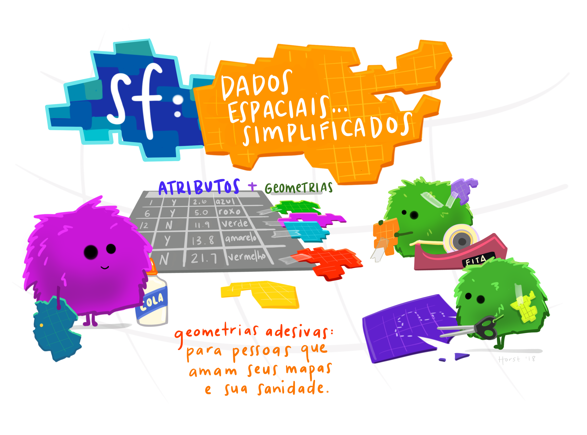

```{r setup, include=FALSE, cache=FALSE}
# set working directory to docs folder
# setwd(here::here("docs"))

# Set global R options
options(htmltools.dir.version = FALSE, servr.daemon = TRUE)

# Set global knitr chunk options
knitr::opts_chunk$set(
  fig.align = "center", 
  cache = TRUE,
  error = FALSE,
  message = FALSE, 
  warning = FALSE, 
  collapse = TRUE 
)

library(tidyverse)
# This is good for getting the ggplot background consistent with
# the html background color
library(ggplot2)
thm <- theme_bw()
theme_set(thm)
```

```{r, echo=FALSE}
# Configurando reticulate
library(reticulate)
reticulate::use_python("/home/felipe/anaconda3/bin/python")
```

class: title-slide   
<a href="https://github.com/dataAt/intro-analise-de-dados-apresentacao" class="github-corner" aria-label="Código no Github"><svg width="80" height="80" viewBox="0 0 250 250" style="fill:#fff; color:#151513; position: absolute; top: 0; border: 0; right: 0;" aria-hidden="true"><path d="M0,0 L115,115 L130,115 L142,142 L250,250 L250,0 Z"></path><path d="M128.3,109.0 C113.8,99.7 119.0,89.6 119.0,89.6 C122.0,82.7 120.5,78.6 120.5,78.6 C119.2,72.0 123.4,76.3 123.4,76.3 C127.3,80.9 125.5,87.3 125.5,87.3 C122.9,97.6 130.6,101.9 134.4,103.2" fill="currentColor" style="transform-origin: 130px 106px;" class="octo-arm"></path><path d="M115.0,115.0 C114.9,115.1 118.7,116.5 119.8,115.4 L133.7,101.6 C136.9,99.2 139.9,98.4 142.2,98.6 C133.8,88.0 127.5,74.4 143.8,58.0 C148.5,53.4 154.0,51.2 159.7,51.0 C160.3,49.4 163.2,43.6 171.4,40.1 C171.4,40.1 176.1,42.5 178.8,56.2 C183.1,58.6 187.2,61.8 190.9,65.4 C194.5,69.0 197.7,73.2 200.1,77.6 C213.8,80.2 216.3,84.9 216.3,84.9 C212.7,93.1 206.9,96.0 205.4,96.6 C205.1,102.4 203.0,107.8 198.3,112.5 C181.9,128.9 168.3,122.5 157.7,114.1 C157.9,116.9 156.7,120.9 152.7,124.9 L141.0,136.5 C139.8,137.7 141.6,141.9 141.8,141.8 Z" fill="currentColor" class="octo-body"></path></svg></a><style>.github-corner:hover .octo-arm{animation:octocat-wave 560ms ease-in-out}@keyframes octocat-wave{0%,100%{transform:rotate(0)}20%,60%{transform:rotate(-25deg)}40%,80%{transform:rotate(10deg)}}@media (max-width:500px){.github-corner:hover .octo-arm{animation:none}.github-corner .octo-arm{animation:octocat-wave 560ms ease-in-out}}</style>

<br><br><br><br>
# .font200[Introdução à manipulação de dados espaciais] 

<br><br>
### Felipe Carvalho & Felipe Menino
### Janeiro 2020

---
# Agenda

<br><br>


- .font120[Introdução]

- .font120[Motivação]

- .font120[Pacote SF `r anicon::faa("r-project", animate = 'float', speed = 'slow', color = 'steelblue')`]

- .font120[Biblioteca Geopandas `r anicon::cia("./images/2_r_img/logo_tidyverse_menor.png", animate = 'float', speed = 'slow')`]

- .font120[Exemplos de utilização]

- .font120[Prática]

<br>

---

class: title-slide

<br><br><br>
# .center.font170[Introdução]
---
# Introdução
---
# Motivação
---
class: title-slide

## .center.font110[Pacote SF]


```{r fig100, echo=FALSE, fig.align="center", out.height = "50%",out.width = "50%"}
  
```

.center.font80[Fonte: https://github.com/allisonhorst/stats-illustrations]
---
# Pacote SF

.font120[Simple Features] ou .font120[Simple Features Access] refere-se a norma (ISO 19125-1:2004) que descreve como os objetos no mundo real podem ser representados em computadores, com ênfase na geometria espacial destes objetos.

```{r fig120, echo=FALSE ,fig.align="center", out.height = "60%",out.width = "60%"}
  knitr::include_graphics("images/2_r_img/sf_deps.png")
```

---
# Pacote SF
.font120[Tês classes principais do pacote `sf` são:]

- **sfg: simple feature geometry** Único objeto geométrico, por exemplo, `POINT`.
- **sfc: Simple feature column**  Coluna com um conjunto de objetos geométricos.
- **sf: Simple feature** Um Data Frame com um ou mais tipos geométricos, em como atributos discretos, categóricos que representam características do objeto.

```{r fig130, echo=FALSE ,fig.align="center", out.height = "65%",out.width = "65%",}
  knitr::include_graphics("images/2_r_img/sf_xfig.png")
```

---
class: title-slide

<br><br><br>
# .center.font170[Geopandas]
---

# GeoPandas `r emo::ji("earth")` `r emo::ji("panda_face")`

---

# Tipos geométricos SF e Geopandas

.pull-left[
.center.font100[**SF**]

```{r, echo=FALSE}
  library(sf)
```
.blue.font80[**POINT**]
```{r}
ponto <- sf::st_point(c(3,4))
```

```{r, echo=FALSE}
  ponto
```
.blue.font80[**LINESTRING**]
```{r}
  linestring <- sf::st_linestring(
    rbind(c(2,1), c(4,4), c(8,2), c(4,2))
  )
```

```{r, echo=FALSE}
  linestring
```
.blue.font80[**POLYGON**]

```{r}
  poligono <-  sf::st_polygon(
    list(rbind(c(2,1), c(1,2), c(1,5), c(5,3), c(2,1)))
  )
```

```{r, echo=FALSE}
  poligono
```

]

.pull-right[
.center.font100[**Geopandas**]
]

---
# Tipos geométricos SF e Geopandas


.pull-left[
.center.font100[**SF**]

.blue.font80[**MULTIPOINT**]
```{r}
multi_ponto <- sf::st_multipoint(
  rbind(c(2,4), c(1,2), c(3,1), c(4,3), c(3,2))
)
```

```{r, echo=FALSE}
multi_ponto
```
.blue.font80[**MULTILINESTRING**]
```{r}
multi_linestring <- sf::st_multilinestring(
  list(
    rbind(c(1,3), c(4,4), c(5,2), c(3,0),c(1,1)),
    rbind(c(1,4), c(4,5), c(1,5))
    )
  )
```

```{r, echo=FALSE}
  multi_linestring
```

]

.pull-right[
.center.font100[**Geopandas**]
]
---


# Tipos geométricos SF e Geopandas


.pull-left[
.center.font100[**SF**]

.blue.font80[**MULTIPOLYGON**]
```{r}
  poligono_p1 <- rbind(c(2,3), c(6,1), c(2,1), c(2,3))
  poligono_p2 <- rbind(c(6,5), c(4,4), c(6,2), c(8,4), c(6,5))
  poligono_p2_1 <- rbind(c(5,4), c(6,3), c(6,4), c(5,4))
  
  multi_poligono <- sf::st_multipolygon(
    list(
      list(poligono_p1), list(poligono_p2, poligono_p2_1)))
```

```{r, echo=FALSE}
  multi_poligono
```

.blue.font80[**GEOMETRYCOLLECTION**]

```{r}
  geometrycollection <- sf::st_geometrycollection(
    list(multi_ponto, multi_linestring, multi_poligono)
    )
```
]

.pull-right[
.center.font100[**Geopandas**]
]
---


# Tipos geométricos SF e Geopandas


.pull-left[
```{r, echo=FALSE, fig.align="center", out.width="100%", out.height="100%"}
  old_par = par(mfrow = c(1, 3), pty = "s", mar = c(0, 3, 1, 0.3))  
  

  plot(ponto, col = 'red', main="POINT", axes=TRUE)
  plot(linestring, col='red', main = "LINESTRING", axes=TRUE)
  plot(poligono, border='red', col='grey', main="POLYGON", axes=TRUE)

  par(old_par)
  
```
]

.pull-right[
```{r, echo=FALSE, fig.align="center", out.width="100%", out.height="100%"}
 old_par = par(mfrow = c(2, 2), pty = "s", mar = c(2, 3, 1, 1))  
  

  plot(multi_ponto, col = 'red', main="MULTIPOINT", axes=TRUE)
  plot(multi_linestring, col='red', main = "MULTILINESTRING", axes=TRUE)
  plot(multi_poligono, border='red', col='grey', main="MULTIPOLYGON", axes=TRUE)
  plot(geometrycollection, border='grey', col='grey', main="GEOMETRYCOLLECTION", axes=TRUE)

  par(old_par)

```
]
---
# Relacionamentos espaciais

### `Equals` - Verifica se duas geométrias são iguais;

### `Disjoint` - Verifica se duas geométrias são disjuntas;

### `Touches` - Verifica se duas geométricas se tocam;

### `Crosses` - Verifica se duas geométricas se cruzam;

### `Within`- Verifica se a geométria A está contida em B;

### `Contains` - Verifica se a geométria B contêm a geometria A;

### `Overleaps` - Verifica se duas geométrias se sobrepõem;

### `Intersects` - Verifica se duas geométricas se interseccionam.

---


class: title-slide

<br><br><br>
# .center.font170[Prática]
---

# `Equals`

.pull-left[

```{r, echo=FALSE}
  # Definição dos pontos
  poligono_1 <- rbind(c(1,1), c(1,5), c(5,5), c(1,1))
  poligono_2 <- rbind(c(5,3), c(5,5), c(3,5), c(1,5),
                      c(1,3), c(1,1), c(3,1), c(5,1),
                      c(5,3))
  
  # Criação dos tipos geométricos
  polygon_a <- sf::st_polygon(list(poligono_1))
  polygon_b <- sf::st_polygon(list(poligono_2))
  
```

```{r, echo=FALSE, fig.align="center", warning=F}
  
  xlim <- c(1,5)
  ylim <- c(1,5)
    suppressMessages(library(scales))

  
  plot(sf::st_as_sfc(sf::st_as_text(polygon_b)), border='blue', col=alpha("grey", 0.5),axes = TRUE, main="Os polígonos 1 e 2 são iguais?", lwd = 2, xlim=xlim ,ylim= ylim, cex.main=1.5, cex.axis=1.3, xlab= "X", ylab="Y",  cex.lab=1.5)
  
  plot(sf::st_as_sfc(sf::st_as_text(polygon_a)), axes = TRUE, border = 'red',col=alpha("grey", 0.5), main="POLYGON A", add=TRUE, reset=FALSE, lwd = 2, lty = 2, xlim=xlim ,ylim= ylim)
  legend(-0.9, 5, legend=c("POLYGON 1", "POLYGON 2"),
       col=c("blue", "red"), lty=1:2, cex=0.8)
```
]

--

.pull-right[

.center.font100[**Solução**]

.blue.font80[**SF**]

```{r, eval=FALSE}
  sf::st_equals(polygon_a, polygon_b, sparse = FALSE)[1,]
```

.blue.font80[**Geopandas**]

```{python, eval=FALSE}
  code = 1+1
```

```{r, echo=FALSE}
  sf::st_equals(polygon_a, polygon_b, sparse = FALSE)[1,]
```
]

---

# `Disjoint`

.pull-left[

```{r, echo=FALSE}
  # Criação dos linestrings
  segmento_1 <- rbind(c(1.5,5), c(3,5), c(4,6), c(6,5))
  segmento_2 <- rbind(c(1,6), c(1,4), c(4,4))
  
  # Criação dos tipos geométricos linestring
  linestring_1 <- sf::st_linestring(segmento_1)
  linestring_2 <- sf::st_linestring(segmento_2)
```

```{r, echo=FALSE, fig.align="center", warning=F}
 
  xlim <- c(1,6)
  ylim <- c(4,6)

plot(sf::st_as_sfc(sf::st_as_text(linestring_2)), axes = TRUE, col = 'red', main="Os segmentos 1 e 2 são disjuntos?", lwd = 2, lty = 2,xlim=xlim ,ylim= ylim, xlab= "X", ylab="Y",  cex.lab=1.5, cex.main=1.5, cex.axis=1.3)
    plot(sf::st_as_sfc(sf::st_as_text(linestring_1)), col='blue', axes = FALSE, main="LINESTRING", lwd = 2,  add=TRUE, reset=FALSE, xlim=xlim ,ylim= ylim)
  
  
  legend(4.8, 6.3, legend=c("LINESTRING 1", "LINESTRING 2"),
       col=c("red", "blue"), lty=2:1, cex=0.8)
  
```
]

--

.pull-right[

.center.font100[**Solução**]

.blue.font80[**SF**]

```{r, eval=FALSE}
  sf::st_disjoint(linestring_1,linestring_2, sparse = FALSE)[1,]
```

.blue.font80[**Geopandas**]

```{python, eval=FALSE}
  code = 1+1
```

```{r, echo=FALSE}
  sf::st_disjoint(linestring_1,linestring_2, sparse = FALSE)[1,]
```
]

---

# `Disjoint`

.pull-left[

```{r, echo=FALSE}
    # Criação dos polígonos
  poligono_1 <- rbind(c(1,1), c(1,2), c(3,2), c(3,2),
                      c(3,1), c(1,1))
  poligono_2 <- rbind(c(3,3), c(5,3), c(5,2),
                      c(3,2), c(3,3))
  
  # Criação dos tipos geométricos polygons
  polygon_1 <- sf::st_polygon(list(poligono_1))
  polygon_2 <- sf::st_polygon(list(poligono_2))
```

```{r, echo=FALSE, fig.align="center"}

  xlim <- c(1,5)
  ylim <- c(1,3)

    
  plot(sf::st_as_sfc(sf::st_as_text(polygon_1)), axes = TRUE, border = "red",  main="Os polígonos 1 e 2 são disjuntos?", lwd = 2,col=alpha("grey", 0.5), lty = 2, xlim =xlim, ylim = ylim, cex.main=1.5, cex.axis=1.3, xlab= "X", ylab="Y",  cex.lab=1.5)

  plot(sf::st_as_sfc(sf::st_as_text(polygon_2)), border = "blue", axes = FALSE, main="LINESTRING", lwd = 2,  col=alpha("grey", 0.5),add=TRUE, reset=FALSE, xlim =xlim, ylim = ylim )
  
  
  legend(1.1, 3, legend=c("POLYGON 1", "POLYGON 2"),
       col=c("red", "blue"), lty=2:1, cex=0.9)
```
]

--

.pull-right[

.center.font100[**Solução**]

.blue.font80[**SF**]

```{r, eval=FALSE}
   sf::st_disjoint(polygon_1,polygon_2, sparse = FALSE)[1,]
```

.blue.font80[**Geopandas**]

```{python, eval=FALSE}
  code = 1+1
```

```{r, echo=FALSE}
  sf::st_disjoint(polygon_1,polygon_2, sparse = FALSE)[1,]
```
]

---

# `Touches`

.pull-left[

```{r, echo=FALSE}
  # Criação dos polígonos
  poligono_1 <- rbind(c(1, 1), c(1, 3), c(4, 3), c(4,1), c(1,1))
  poligono_2 <- rbind(c(4,2), c(4,4), c(6,4), c(6,2), c(4,2))
  
  # Criação dos tipos geométricos
  polygon_1 <- sf::st_polygon(list(poligono_1))
  polygon_2 <- sf::st_polygon(list(poligono_2))
```

```{r, echo=FALSE, fig.align="center"}
  xlim <- c(1,6)
  ylim <- c(1,4)

    
  plot(sf::st_as_sfc(sf::st_as_text(polygon_1)), axes = TRUE, border = "red",  main="Os polígonos 1 e 2 se tocam?", lwd = 2, lty = 2, xlim =xlim, ylim = ylim,col=alpha("grey", 0.5), xlab= "X", ylab="Y",  cex.lab=1.5, cex.main=1.5, cex.axis=1.3)

  plot(sf::st_as_sfc(sf::st_as_text(polygon_2)), border = "blue", axes = FALSE, main="LINESTRING", lwd = 2,  add=TRUE, reset=FALSE, xlim =xlim, ylim = ylim,col=alpha("grey", 0.5))
  
  
  legend(1, 4, legend=c("POLYGON 1", "POLYGON 2"),
       col=c("red", "blue"), lty=2:1, cex=0.9)
```
]

--

.pull-right[

.center.font100[**Solução**]

.blue.font80[**SF**]

```{r, eval=FALSE}
   sf::st_touches(polygon_1, polygon_2, sparse = FALSE)[1,]
```

.blue.font80[**Geopandas**]

```{python, eval=FALSE}
  code = 1+1
```

```{r, echo=FALSE}
  sf::st_touches(polygon_1, polygon_2, sparse = FALSE)[1,]
```
]

---

# `Crosses`

.pull-left[

```{r, echo=FALSE}
  # Criação da reta e polígono
  segmento_1 <- rbind(c(11,5), c(13,5), c(13,6))
  poligono_1 <- rbind(c(12,4), c(12,7), c(15,4), c(12,4))
  
  # Criação dos objetos geométricos
  linestring_1 <- sf::st_linestring(segmento_1)
  polygon_1 <- sf::st_polygon(list(poligono_1))
```

```{r, echo=FALSE, fig.align="center"}
 
   xlim <- c(11,15)
  ylim <- c(4,7)

    
  plot(sf::st_as_sfc(sf::st_as_text(linestring_1)), axes = TRUE, col = "red",  main="As geometrias se cruzam?", lwd = 2, lty = 2, xlim =xlim, ylim = ylim,  xlab= "X", ylab="Y",  cex.lab=1.5, cex.main=1.5, cex.axis=1.3)

  plot(sf::st_as_sfc(sf::st_as_text(polygon_1)), border = 'blue', axes = FALSE, main="LINESTRING", lwd = 2,  add=TRUE, reset=FALSE, xlim =xlim, ylim = ylim, col=alpha("grey", 0.4))
  
  
  legend(13.9, 7, legend=c("LINESTRING 1", "POLYGON 1"),
       col=c("red", "blue"), lty=2:1, cex=0.8)
  
```
]

--

.pull-right[

.center.font100[**Solução**]

.blue.font80[**SF**]

```{r, eval=FALSE}
   sf::st_touches(polygon_1, polygon_2, sparse = FALSE)[1,]
```

.blue.font80[**Geopandas**]

```{python, eval=FALSE}
  code = 1+1
```

```{r, echo=FALSE}
  sf::st_touches(polygon_1, polygon_2, sparse = FALSE)[1,]
```
]

---

# `Crosses`

.pull-left[

```{r, echo=FALSE}
  # Criação da reta e dos pontos
  segmento_1 <- rbind(c(8,1), c(8,3), c(10,3))
  ponto_1 <- rbind(c(9,2), c(9,3), c(10,2))
  
  # Criação dos objetos geométricos
  linestring_1 <- sf::st_linestring(segmento_1)
  multipoint_1 <- sf::st_multipoint(ponto_1)
```

```{r, echo=FALSE, fig.align="center"}
  xlim <- c(8,10)
  ylim <- c(1,3)

    
  plot(sf::st_as_sfc(sf::st_as_text(linestring_1)), axes = TRUE, col = "red",  main="As geometrias se cruzam?", lwd = 2, lty = 2, xlim =xlim, ylim = ylim,  xlab= "X", ylab="Y", cex.lab=1.5, cex.main=1.5, cex.axis=1.3)

  plot(sf::st_as_sfc(sf::st_as_text(multipoint_1)), col = 'blue', axes = FALSE, main="LINESTRING", lwd = 2,  add=TRUE, reset=FALSE, xlim =xlim, ylim = ylim)
  
  
  legend(9.5, 1.3, legend=c("LINESTRING 1", "POINT 2"),
       col=c("red", "blue"), lty=2:1, cex=0.8)
  
```
]

--

.pull-right[

.center.font100[**Solução**]

.blue.font80[**SF**]

```{r, eval=FALSE}
   sf::st_crosses(linestring_1, multipoint_1, sparse = FALSE)[1,]
```

.blue.font80[**Geopandas**]

```{python, eval=FALSE}
  code = 1+1
```

```{r, echo=FALSE}
  sf::st_crosses(linestring_1, multipoint_1, sparse = FALSE)[1,]
```
]

---


# `Within`

.pull-left[

```{r, echo=FALSE}
  # Criação dos polígonos  
  poligono_1 <- rbind(c(2,2), c(2,4), c(4,4), c(4,2), c(2,2))
  poligono_2 <- rbind(c(1,1), c(1,5), c(5,5), c(5,1), c(1,1))
  
  # Criação dos objetos geométricos
  polygon_1 <- sf::st_polygon(list(poligono_1))
  polygon_2 <- sf::st_polygon(list(poligono_2))
```

```{r, echo=FALSE, fig.align="center"}
   
  xlim <- c(1,5)
  ylim <- c(1,5)

  plot(sf::st_as_sfc(sf::st_as_text(polygon_1)), axes = TRUE, border = "red",  main="O polígono azul contém o polígono red?", lwd = 2, lty = 2, xlim =xlim, ylim = ylim, col=alpha("grey", 0.5),  xlab= "X", ylab="Y", cex.lab=1.5, cex.main=1.5, cex.axis=1.3)

  plot(sf::st_as_sfc(sf::st_as_text(polygon_2)), border = "blue", axes = FALSE, main="LINESTRING", lwd = 2,  add=TRUE, col=alpha("grey", 0.4), reset=FALSE, xlim =xlim, ylim = ylim )
  
  
  legend(-0.9, 4.9, legend=c("POLYGON 1", "POLYGON 2"),
       col=c("red", "blue"), lty=2:1, cex=0.8)
```
]

--

.pull-right[

.center.font100[**Solução**]

.blue.font80[**SF**]

```{r, eval=FALSE}
   sf::st_within(polygon_1, polygon_2, sparse=FALSE)[1,]
```

.blue.font80[**Geopandas**]

```{python, eval=FALSE}
  code = 1+1
```

```{r, echo=FALSE}
  sf::st_within(polygon_1, polygon_2, sparse=FALSE)[1,]
```
]

---


# `Contains`

.pull-left[

```{r, echo=FALSE}
  # Criação do ponto e do polígono  
  poligono_1 <- rbind(c(1,6), c(1,9), c(5,9), c(5,6), c(1,6))
  ponto_1 <- c(3,8)
  
  # Criação dos tipos geométricos
  polygon_1 <- sf::st_polygon(list(poligono_1))
  point_1 <- sf::st_point(ponto_1)
```

```{r, echo=FALSE, fig.align="center"}
      
  xlim <- c(1,5)
  ylim <- c(6,9)

  plot(sf::st_as_sfc(sf::st_as_text(point_1)), axes = TRUE, col = "red",  main="O ponto vermelho está dentro do polígono azul?", lwd = 2, lty = 2, xlim =xlim, ylim = ylim,  xlab= "X", ylab="Y", cex.lab=1.5, cex.main=1.5, cex.axis=1.3)

  plot(sf::st_as_sfc(sf::st_as_text(polygon_1)), border = "blue", axes = FALSE, main="LINESTRING", lwd = 2,  add=TRUE, reset=FALSE, xlim =xlim, ylim = ylim, col=alpha("grey", 0.5))
  
  
  legend(0, 9, legend=c("POINT 1", "POLYGON 1"),
       col=c("red", "blue"), lty=2:1, cex=0.5)
```
]

--

.pull-right[

.center.font100[**Solução**]

.blue.font80[**SF**]

```{r, eval=FALSE}
   sf::st_contains(polygon_1, point_1, sparse = FALSE)[1,]
```

.blue.font80[**Geopandas**]

```{python, eval=FALSE}
  code = 1+1
```

```{r, echo=FALSE}
  sf::st_contains(polygon_1, point_1, sparse = FALSE)[1,]
```
]

---


# `Overlaps`

.pull-left[

```{r, echo=FALSE}
  # Criação dos polígonos
  poligono_1 <- rbind(c(7,1), c(7,3), c(10,3), c(10,1), c(7,1))
  poligono_2 <- rbind(c(13,1), c(9,2), c(13,4), c(13,1 ))
  
  # Criação dos tipos geométricos
  polygon_1 <- sf::st_polygon(list(poligono_1))
  polygon_2 <- sf::st_polygon(list(poligono_2))
```

```{r, echo=FALSE, fig.align="center"}
  xlim <- c(7,13)
  ylim <- c(1,4)

  plot(sf::st_as_sfc(sf::st_as_text(polygon_1)), axes = TRUE, border = "red",  main="O polígono 1 sobrepõe o polígono 2?", lwd = 2, lty = 2, xlim =xlim, ylim = ylim, col=alpha("grey", 0.5),  xlab= "X", ylab="Y", cex.lab=1.5, cex.main=1.5, cex.axis=1.3)

  plot(sf::st_as_sfc(sf::st_as_text(polygon_2)), border = "blue", axes = FALSE, main="LINESTRING", lwd = 2,  add=TRUE, reset=FALSE, xlim =xlim, ylim = ylim,col=alpha("grey", 0.35))
  
  
  legend(7, 4, legend=c("POLYGON 1", "POLYGON 2"),
       col=c("red", "blue"), lty=2:1, cex=0.8)
```
]

--

.pull-right[

.center.font100[**Solução**]

.blue.font80[**SF**]

```{r, eval=FALSE}
   sf::st_overlaps(polygon_1, polygon_2, sparse = FALSE)[1,]
```

.blue.font80[**Geopandas**]

```{python, eval=FALSE}
  code = 1+1
```

```{r, echo=FALSE}
  sf::st_overlaps(polygon_1, polygon_2, sparse = FALSE)[1,]
```
]

---

class: title-slide

<br><br><br>
# .center.font170[Operadores métricos `r emo::ji("ruler")`]
---
# Operadores métricos

<br>

## `st_area` - Área de um tipo geométrico poligonal
## `st_length` - Comprimento de tipos geométricos 1D (`LINESTRING`)
---


