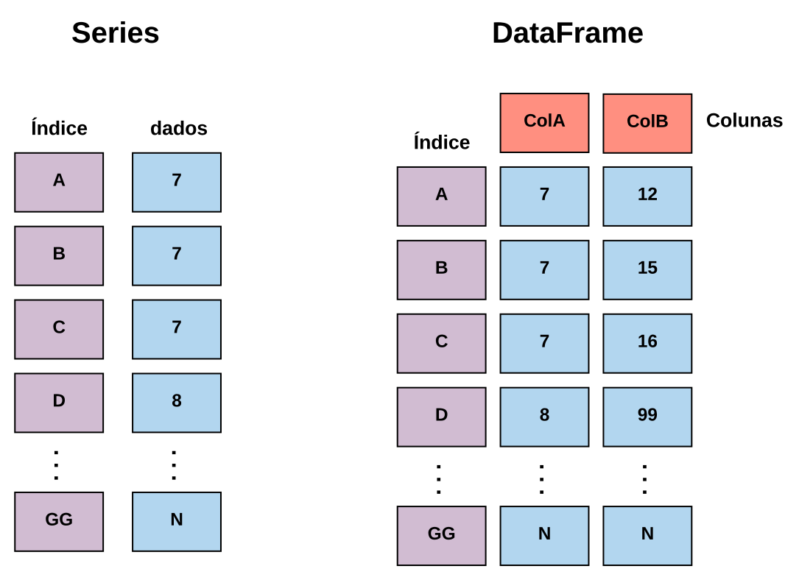
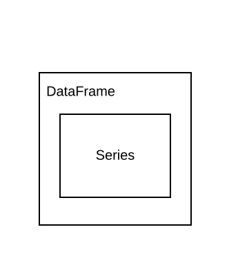
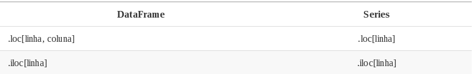
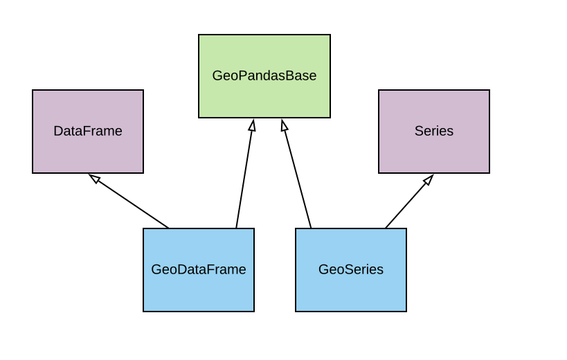

exclude: true
<style type="text/css">
code.r{
  font-size: 16px;
}
pre {
  font-size: 16px !important;
}
</style>
```{r setup, include=FALSE}
options(htmltools.dir.version = FALSE)
```
---
class: bg-main1

# Agenda

--
### Pandas `r emo::ji("heavy_check_mark")`

--
### GeoPandas `r emo::ji("heavy_check_mark")`

---
class: bg-main1

# Pandas `r emo::ji("panda_face")`

.blockquote.font_large[
Pandas é uma biblioteca open source, licenciada pelo BSD, que fornece estruturas de dados de alto desempenho e fáceis de usar e ferramentas de análise de dados para a linguagem de programação Python.
]

<br>

--
#### Para importar a biblioteca utilize

```{python}
import pandas as pd
```

---
class: middle bg-main1

# Estruturas de dados básicas do Pandas

### O Pandas trabalha utilizando duas estruturas de dados básicas, as .yellow[Series] e os .yellow[DataFrames]

---
class: middle bg-main1

# Estruturas de dados básicas do Pandas

<center>
<div class="imageContainer divWithWhiteBackground">
  
</div>
</center>

---
class: middle bg-main1

# Estruturas de dados básicas do Pandas

<center>
<div class="imageContainer divWithWhiteBackground">
  
</div>
</center>

---
class: middle bg-main1

# Series

### Estruturas unidimensionais;
### Trabalham apenas com linhas;
### Utilizam índices nas linhas.

---
class: bg-main1

# Series - Utilização

--
### Criando uma Series simples

```{python}
series = pd.Series([1, 2]); print(series)
```

--
### Criando com índice
```{python}
series = pd.Series([1, 2], [9, 'ultimo']); print(series)
```

--
### Recuperando dados
```{python}
print(series[9])

print(series['ultimo'])
```

---
class: bg-main1

# Series - Utilização

<br><br><br>

--
### Vendo a unidimensionalidade

```{python}
series = pd.Series([[1, 2, 3], [4, 5, 6]]); print(series)
```

---
class: middle bg-main1

# DataFrames

### Estruturas multidimensionais;
### Trabalham com linhas e colunas.
### Pode-se utilizar índices nas linhas ou através das colunas.

---
class: bg-main1

# DataFrame - Utilização

<br><br>

--
### Criando um DataFrame simples

```{python}
df = pd.DataFrame([1, 2, 3, 4]); print(df)
```

--
### Criando com índice

```{python}
df = pd.DataFrame([1, 2, 3, 4], [9, 10, 11, 'ultimao']); print(df)
```

---
class: bg-main1

# DataFrame - Utilização

--
### Recuperando dados

```{python}
print(df[0]) 
print(df[0]['ultimao'])
```

--
### Entendendo a diferença entre o .yellow[Series] e o .yellow[DataFrame].

```{python}
df = pd.DataFrame([[1, 2, 3], [4, 5, 6]]); print(df)
```

---
class: middle bg-main1

# Manipulação básicas de dados com Pandas

### Uma parte muito importante é a .yellow[seleção] e .yellow[filtro] dos dados, com elas basicamente faremos a manipulação dos dados.

---
class: bg-main1

# Manipulação básicas de dados com Pandas

### Loc e iloc

Vamos começar fazendo a busca utilizando os índices (index) e as colunas (No caso dos DataFrames). Para isto, vamos utilizar os métodos .loc e .iloc. 

<br>

<center>

</center>

Para exemplificar o uso destes métodos, vamos utilizar o seguinte .yellow[DataFrame]

```{python}
df = pd.DataFrame({
  'nome': ['Joana', 'Maria', 'Josefa'],
  'idade': [15, 18, 21],
  'nota': [8, 9, 10]
}, index = [7, 8, 9])
```

---
class: bg-main1

# Manipulação básicas de dados com Pandas

### Loc e iloc

```{python}
print(df.loc[9, 'nome'])

print(df.loc[9, ['nome', 'idade']])
```

```{python}
print(df.iloc[2]['nome'])

print(df.iloc[2][['nome', 'idade']])
```

---
class: bg-main1

# Indexação booleana

### Dentro do .yellow[DataFrame] e das .yellow[Series] é possível passar uma expressão booleana para realizar a filtragem dos dados.

<br><br>

```{python}
df = pd.DataFrame({'coluna': [1, 2, 3, 4, 5, 6, 7, 8, 9, 10]})

print(df[df['coluna'] >= 5])
```

---
class: bg-main1

# GeoPandas `r emo::ji("earth")` `r emo::ji("panda_face")`

.blockquote.font_large[
GeoPandas é um projeto open-source que busca facilitar o trabalho com dados vetoriais em Python, para isto, tem como base as estruturas de dados do Pandas
]

---
class: bg-main1

# O Pandas faz muito... `r emo::ji("wrench")``r emo::ji("hammer")``r emo::ji("pill")`

<br><br><br><br><br>

### A verdade é que o Pandas já é uma biblioteca gigante, que possui uma infinidade de facilidades, porém, por padrão, não realiza a manipulação de dados espaciais.

---
class: bg-main1

# Boas bibliotecas de representação geométrica `r emo::ji("milky_way")`

<br><br><br><br><br>

### Dentro do ecossistema Python já existe bibliotecas como .yellow[Shapely] que já fazem boas implementações de representações e operações geométricas.

---
class: middle bg-main1

--
## Necessidade de manipulação de dados espaciais

--
## +

--
## Biblioteca de manipulação geométrica

--
## +

--
## Pandas e suas funcionalidades de alto nível

--
## =

--
## .yellow[GeoPandas] `r emo::ji("boom")`

---
class: middle bg-main1

# Estruturas de dados básicas do GeoPandas

--
### O GeoPandas disponibiliza duas estruturas de dados básicas, as .yellow[GeoSeries] e os .yellow[GeoDataFrames], sendo que ambas possuem ligação direta com o Pandas e suas estruturas.

---
class: bg-main1

# A junção perfeita (Pandas + Shapely)

<br><br>

<center>
<div class="imageContainerWithExtraBigImage divWithWhiteBackground">
  
</div>
</center>

---
class: bg-main1

# Estrutura de dados do GeoPandas

<br><br>

<center>
<div class="imageContainerWithExtraBigImage divWithWhiteBackground">
  
</div>
</center>

---
class: bg-main1

# Explorando as GeoSeries

### Para começar a fazer os testes, vamos importar o GeoPandas e o Shapely.

<br><br>

```{python}
import shapely
import geopandas as gpd
```

<br>
### Agora, criamos uma .yellow[GeoSeries]

```{python}
gsr = gpd.GeoSeries([
  shapely.geometry.Point(1, 1)
])

print(gsr)
```

---
class: bg-main1

# Explorando as GeoSeries

<br>
### As propriedades das .yellow[Series] são mantidas

```{python}
gsr = gpd.GeoSeries([
  shapely.geometry.Point(1, 1),
  shapely.geometry.Point(2, 2),
  shapely.geometry.Point(4, 3)
])

print(gsr)
```

<br>

.blockquote.font_large[
Estamos criando pontos sem nenhuma referência espacial, ou seja, são apenas representações em um plano cartesiano
]

---
class: middle bg-main1

# Obrigado!