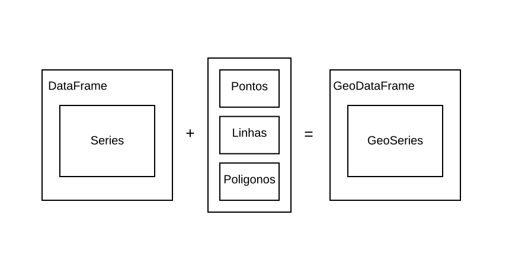
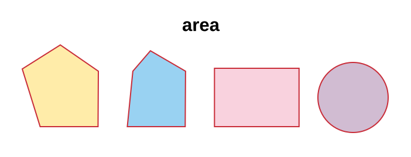
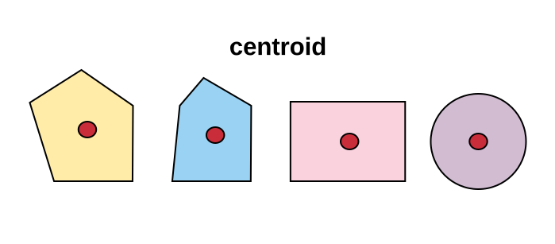

exclude: true
<style type="text/css">
code.r{
  font-size: 16px;
}
pre {
  font-size: 16px !important;
}
</style>
```{r setup, include=FALSE}
options(htmltools.dir.version = FALSE)
```
---
class: bg-main1

```{python, echo = FALSE}
import warnings
warnings.filterwarnings("ignore")
```

# Agenda

--
### Pandas `r emo::ji("heavy_check_mark")`

--
### GeoPandas `r emo::ji("heavy_check_mark")`

---
class: bg-main1

# Pandas `r emo::ji("panda_face")`

.blockquote.font_large[
Pandas é uma biblioteca open source, licenciada pelo BSD, que fornece estruturas de dados de alto desempenho e fáceis de usar e ferramentas de análise de dados para a linguagem de programação Python.
]

<br>

--
#### Para importar a biblioteca utilize

```{python}
import pandas as pd
```

---
class: middle bg-main1

# Estruturas de dados básicas do Pandas

### O Pandas trabalha utilizando duas estruturas de dados básicas, as .yellow[Series] e os .yellow[DataFrames]

---
class: middle bg-main1

# Estruturas de dados básicas do Pandas

<center>
<div class="imageContainer divWithWhiteBackground">
  
</div>
</center>

---
class: middle bg-main1

# Estruturas de dados básicas do Pandas

<center>
<div class="imageContainer divWithWhiteBackground">
  
</div>
</center>

---
class: middle bg-main1

# Series

### Estruturas unidimensionais;
### Trabalham apenas com linhas;
### Utilizam índices nas linhas.

---
class: bg-main1

# Series - Utilização

--
### Criando uma Series simples

```{python}
series = pd.Series([1, 2]); print(series)
```

--
### Criando com índice
```{python}
series = pd.Series([1, 2], [9, 'ultimo']); print(series)
```

--
### Recuperando dados
```{python}
print(series[9])

print(series['ultimo'])
```

---
class: bg-main1

# Series - Utilização

<br><br><br>

--
### Vendo a unidimensionalidade

```{python}
series = pd.Series([[1, 2, 3], [4, 5, 6]]); print(series)
```

---
class: middle bg-main1

# DataFrames

### Estruturas multidimensionais;
### Trabalham com linhas e colunas.
### Pode-se utilizar índices nas linhas ou através das colunas.

---
class: bg-main1

# DataFrame - Utilização

<br><br>

--
### Criando um DataFrame simples

```{python}
df = pd.DataFrame([1, 2, 3, 4]); print(df)
```

--
### Criando com índice

```{python}
df = pd.DataFrame([1, 2, 3, 4], [9, 10, 11, 'ultimao']); print(df)
```

---
class: bg-main1

# DataFrame - Utilização

--
### Recuperando dados

```{python}
print(df[0]) 
print(df[0]['ultimao'])
```

--
### Entendendo a diferença entre o .yellow[Series] e o .yellow[DataFrame].

```{python}
df = pd.DataFrame([[1, 2, 3], [4, 5, 6]]); print(df)
```

---
class: middle bg-main1

# Manipulação básicas de dados com Pandas

### Uma parte muito importante é a .yellow[seleção] e .yellow[filtro] dos dados, com elas basicamente faremos a manipulação dos dados.

---
class: bg-main1

# Manipulação básicas de dados com Pandas

### Loc e iloc

Vamos começar fazendo a busca utilizando os índices (index) e as colunas (No caso dos DataFrames). Para isto, vamos utilizar os métodos .loc e .iloc. 

<br>

<center>

</center>

Para exemplificar o uso destes métodos, vamos utilizar o seguinte .yellow[DataFrame]

```{python}
df = pd.DataFrame({
  'nome': ['Joana', 'Maria', 'Josefa'],
  'idade': [15, 18, 21],
  'nota': [8, 9, 10]
}, index = [7, 8, 9])
```

---
class: bg-main1

# Manipulação básicas de dados com Pandas

### Loc e iloc

```{python}
print(df.loc[9, 'nome'])

print(df.loc[9, ['nome', 'idade']])
```

```{python}
print(df.iloc[2]['nome'])

print(df.iloc[2][['nome', 'idade']])
```

---
class: bg-main1

# Indexação booleana

### Dentro do .yellow[DataFrame] e das .yellow[Series] é possível passar uma expressão booleana para realizar a filtragem dos dados.

<br><br>

```{python}
df = pd.DataFrame({'coluna': [1, 2, 3, 4, 5, 6, 7, 8, 9, 10]})

print(df[df['coluna'] >= 5])
```

---
class: bg-main1

# GeoPandas `r emo::ji("earth")` `r emo::ji("panda_face")`

<br><br><br><br>

.blockquote.font_large[
GeoPandas é um projeto open-source que busca facilitar o trabalho com dados vetoriais em Python, para isto, tem como base as estruturas de dados do Pandas
]

---
class: bg-main1

# O Pandas faz muito... `r emo::ji("wrench")``r emo::ji("hammer")``r emo::ji("pill")`

<br><br><br><br><br>

### A verdade é que o Pandas já é uma biblioteca gigante, que possui uma infinidade de facilidades, porém, por padrão, não realiza a manipulação de dados espaciais.

---
class: bg-main1

# Boas bibliotecas de representação geométrica `r emo::ji("milky_way")`

<br><br><br><br><br>

### Dentro do ecossistema Python já existe bibliotecas como .yellow[Shapely] que já fazem boas implementações de representações e operações geométricas.

---
class: middle bg-main1

--
## Necessidade de manipulação de dados espaciais

--
## +

--
## Biblioteca de manipulação geométrica

--
## +

--
## Pandas e suas funcionalidades de alto nível

--
## =

--
## .yellow[GeoPandas] `r emo::ji("boom")`

---
class: middle bg-main1

# Estruturas de dados básicas do GeoPandas

--
### O GeoPandas disponibiliza duas estruturas de dados básicas, as .yellow[GeoSeries] e os .yellow[GeoDataFrames], sendo que ambas possuem ligação direta com o Pandas e suas estruturas.

---
class: bg-main1

# A junção perfeita (Pandas + Shapely)

<br><br>

<center>
<div class="imageContainerWithExtraBigImage divWithWhiteBackground">
  
</div>
</center>

---
class: bg-main1

# Estrutura de dados do GeoPandas

<br><br>

<center>
<div class="imageContainerWithExtraBigImage divWithWhiteBackground">
  
</div>
</center>

---
class: bg-main1

# Explorando as GeoSeries

### Para começar a fazer os testes, vamos importar o GeoPandas e o Shapely.

<br><br>

```{python}
import shapely
import geopandas as gpd
```

<br>
### Agora, criamos uma .yellow[GeoSeries]

```{python}
gsr = gpd.GeoSeries([
  shapely.geometry.Point(1, 1)
])

print(gsr)
```

---
class: bg-main1

# Explorando as GeoSeries

<br>
### As propriedades das .yellow[Series] são mantidas

```{python}
gsr = gpd.GeoSeries([
  shapely.geometry.Point(1, 1),
  shapely.geometry.Point(2, 2),
  shapely.geometry.Point(4, 3)
])

print(gsr)
```

<br>

.blockquote.font_large[
Estamos criando pontos sem nenhuma referência espacial, ou seja, são apenas representações em um plano cartesiano
]

---
class: bg-main1

# Explorando as GeoSeries

<br>
### Vamos visualizar os dados

```
gsr.plot()
```

<center>
```{python, echo = FALSE}
gsr.plot(figsize=(4, 4))
```
</center>

---
class: middle bg-main1

# As GeoSeries são Series!

--
### Por herdar diretamente das Series as características básicas dela são mantidas nas .yellow[GeoSeries]

<br><br>
```{python}
gsr = gpd.GeoSeries({
  'atributo_a': [10, 11, 12],
  'geometria': [
    shapely.geometry.Point(1, 1),
    shapely.geometry.Point(2, 2),
    shapely.geometry.Point(4, 3)
  ]
})

print(gsr)
```

---
class: middle bg-main1

# Neste caso, utilizamos os .yellow[GeoDataFrames]

---
class: middle bg-main1

# Os GeoDataFrames são DataFrames!

<br><br><br><br>
```{python}
gsr = gpd.GeoDataFrame({
  'atributo_a': [10, 11, 12],
  'geometria': [
    shapely.geometry.Point(1, 1),
    shapely.geometry.Point(2, 2),
    shapely.geometry.Point(4, 3)
  ]
})

print(gsr)
```

---
class: middle bg-main1

# Fazendo leitura de dados `r emo::ji("scroll")`

--
### O GeoPandas, além das estruturas de dados, disponibiliza forma de leitura dos dados

---
class: bg-main1

# Fazendo leitura de dados `r emo::ji("scroll")`

<br><br><br>

--
### GeoJSON

--
### GPSTrackMaker

--
### ESRI Shapefile

--
### FileGDB

--
### OpenFileGDB

---
class: bg-main1

# Fazendo leitura de dados `r emo::ji("scroll")` - Shapefile

--
### Vamos carregar um arquivo Shapefile como exemplo

```{python}
gdf = gpd.read_file("./data/1_estados_do_brasil_shape/abrasil.shp")

print(type(gdf))
```

--
### Verificando os dados carregados

```{python}
print(gdf.head(5))
```

.blockquote.font_large[
`head` é um exemplo de método que vem do DataFrame
]

---
class: bg-main1

# Fazendo leitura de dados `r emo::ji("scroll")` - Shapefile

--
### Vamos verificar as colunas carregadas

```{python}
print(gdf.columns)
```

<br>

--
### Visualizando colunas específicas

```{python}
print(gdf["geometry"].head(5))
```

---
class: bg-main1

# Manipulando a coluna de .yellow[geometrias]

<br><br><br><br>

--
### Por padrão uma columa de nome .yellow[geometry] é criado com os dados de geometrias encontrados, mas nada impede que façamos mudanças nela

<br><br>

--
### Vamos começar com um teste simples, mudar o nome da coluna

```{python}
gdf = gdf.rename_geometry("geometria")

print(gdf.columns)
```

---
class: middle bg-main1


## Ao utilizar o método .yellow[rename_geometry] o nome da coluna utilizada como padrão muda para o inserido

---
class: bg-main1

# Manipulando a coluna de .yellow[geometrias]

<br><br>

--
## Consulta ao atributo .yellow[geometry]

```{python}
print(gdf.geometry.head(5))
```

--
```{python}
print(gdf["geometria"].head(5))
```

--
## O atributo faz referência aos dados da coluna .yellow[geometria]

---
class: bg-main1

# Manipulando a coluna de .yellow[geometrias]

<br>

--
## Verificando o nome da coluna de onde os dados de geometrias são recuperados

```{python}
print(gdf.geometry.name)
```

--
## Vamos fazer um teste, mudar o nome da coluna padrão 

```{python}
gdf["geometria_dois"] = gdf["geometria"]

print(gdf.columns)
```

--
```{python}
gdf = gdf.set_geometry("geometria_dois")

print(gdf.geometry.name)
```

---
class: bg-main1

# Manipulando a coluna de .yellow[geometrias]

<br>

--
## Vamos visualizar os dados carregados

```
gdf.plot()
```

<center>
```{python, echo = FALSE}
gdf.plot(figsize=(4, 4))
```
</center>

---
class: middle bg-main1

# Manipulação geométrica `r emo::ji("game_die")`

--
## Todos os métodos apresentados aqui são orientados ao atributo de geometria padrão

---
class: middle bg-main1

# Manipulação geométrica - area

<br>

<center>
<div class="imageContainerOpGeoms divWithWhiteBackground">
  
</div>
</center>

---
class: bg-main1

# Manipulação geométrica - area

<br>

--
## Carregando os dados e calculando a área

```{python}
estados_do_brasil = gpd.read_file("./data/1_estados_do_brasil_shape/abrasil.shp")

estados_do_brasil["area"] = estados_do_brasil.area
```

--
## Visualizando o resultado

```{python}
print(estados_do_brasil["area"].head(5))
```

.blockquote.font_large[
A unidade de medidas dos resultados é a mesma do sistema de referência utilizada
]

---
class: middle bg-main1

# Manipulação geométrica - bounds

<br>

<center>
<div class="imageContainerOpGeoms divWithWhiteBackground">
  
</div>
</center>

---
class: bg-main1

# Manipulação geométrica - bounds

<br><br><br><br><br><br>

```{python}
print(estados_do_brasil.bounds.head(5))
```

---
class: middle bg-main1

# Manipulação geométrica - centroid

<br>

<center>
<div class="imageContainerOpGeoms divWithWhiteBackground">
  
</div>
</center>

---
class: bg-main1

# Manipulação geométrica - centroid

--
## Gerando os centroids

```{python}
centroids_dos_estados = estados_do_brasil.centroid
```

--
## Visualizando os centroids gerados

```
base = estados_do_brasil.plot()
centroids_dos_estados.plot(ax=base, marker="o", color="red")
```

<center>
```{python, echo = FALSE}
base = estados_do_brasil.plot(figsize=(4, 4))
centroids_dos_estados.plot(ax=base, marker="o", color="red")
```
</center>

---
class: bg-main1

# Manipulação geométrica - buffer

<br>

<center>
<div class="imageContainerOpGeomsSpecBuffer divWithWhiteBackground">
  
</div>
</center>

---
class: bg-main1

# Manipulação geométrica - buffer

<br><br><br><br><br><br>

## Gerando o buffer

```{python}
buffers = centroids_dos_estados.buffer(2)
```

---
class: middle bg-main1

## Visualizando os buffers, junto aos centroids

```
base = estados_do_brasil.plot()
base = buffers.plot(ax = base, color = 'yellow')

# Adicionando os centroids também, para testar =D
centroids_dos_estados.plot(ax = base, color = 'red')
```

<center>
```{python, echo = FALSE}
base = estados_do_brasil.plot(figsize=(4, 4))
base = buffers.plot(ax = base, color = 'yellow')

# Adicionando os centroids também, para testar =D
centroids_dos_estados.plot(ax = base, color = 'red')
```
</center>

---
class: bg-main1

# Manipulação geométrica - envelope

<br>

<center>
<div class="imageContainerOpGeomsSpecBuffer divWithWhiteBackground">
  
</div>
</center>

---
class: middle bg-main1

## Gerando os retângulos envolventes
```{python}
envelopes = buffers.envelope
```

## Visualizando 

```
base = estados_do_brasil.plot()

envelopes.plot(ax = base, color = 'green')
```

<center>
```{python, echo = FALSE}
base = estados_do_brasil.plot(figsize=(4, 4))

envelopes.plot(ax = base, color = 'green')
```
</center>

---
class: middle bg-main1

# Obrigado!