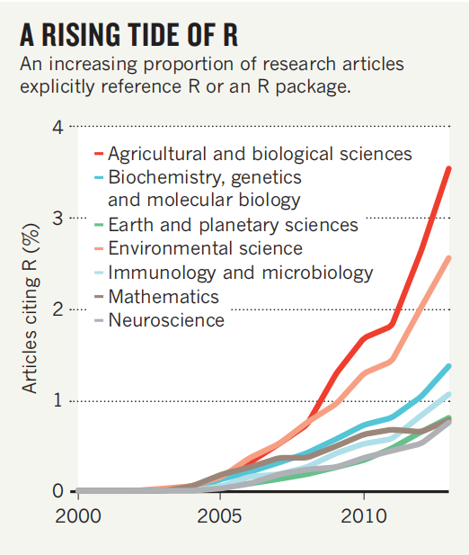
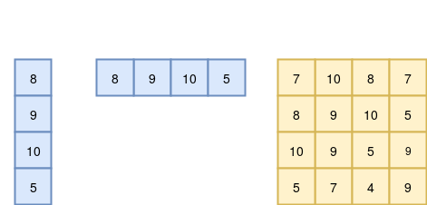
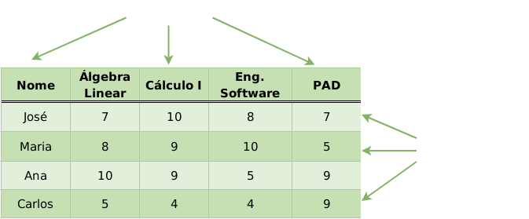
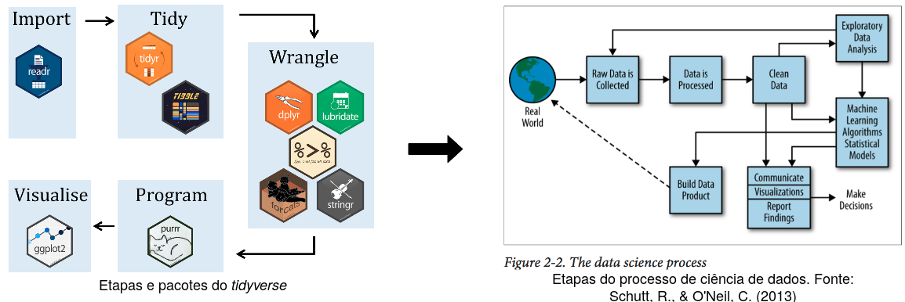
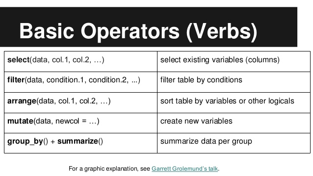

exclude: true
<style type="text/css">
code.r{
  font-size: 16px;
}
pre {
  font-size: 16px !important;
}
</style>
```{r setup, include=FALSE}
  options(htmltools.dir.version = FALSE)
```

---
class: bg-main1

# Agenda

--
### Revisão da linguagem R `r emo::ji("diamond")` 

--
### Kit de ferramentas Tidyverse `r emo::ji("wrench")`

--
### Pacote SF (*Simple Features*)  `r emo::ji("chart")`

---
class: middle bg-main1

# Revisão da linguagem R

---

class: bg-main1

# História do R 

<br>

### **R** é uma linguagem de programação de alto nível com ambiente voltado para visualização e análise de dados. Em essência foi inspirada na linguagem de programação **S**. Foi iniciamente escrito por **R**oss Ihaka and **R**obert Gentleman no departamento de estatística da universidade de Auckland na Nova Zelândia. 

 <div class="row">
  <div class="column">
    <figure>
    
     </figure>
  </div>
  <div class="column">
    
  </div>
</div>

---

class: bg-main1

# Produção de ciência com R
```{r fig1, echo=FALSE ,fig.align="center", out.width = "45%", fig.cap='Série temporal de citações dos pacotes feitos em R'}
  
```

---

class: middle bg-main1

# Comandos básicos

---

class: bg-main1

# Comandos básicos

### Atribuimos valor usando `<-` apontada para a variável

<br><br>

```{r}
inteiro <- 321L

numerico <- 123

complexo <- 321i

booleano <- TRUE ## ou FALSE

caractere <- "Bem-vindos"
```

<br>

### Acessando os valores:

```{r}
print(numerico)

caractere
```

---
class: bg-main1


# Tipos de dados estruturados

<br>

```{r fig2, echo=FALSE ,fig.align="center", out.width = "60%",fig.cap='Estrutura de dados: Vetor e Matriz'}
  
```

---

class: bg-main1


# Tipos de dados estruturados
<br><br>

### Podemos declarar um vetor usando `c()` e uma lista usando `list()` 

<br>

```{r}
vetor <- c(1, 3, 5)

lista <- list(1, 2.3, c("tres", FALSE))
```

```{r}
vetor
```

--

```{r}
lista
```

---
class:bg-main1 

# Qual é a diferença?

<br><br>

## Vetores são atômicos, ou seja, só aceitam um tipo:
<br>
--

```{r}
vetor_diferente <- c(1, 2.5, TRUE, "ola")
vetor_diferente
```

--
## Listas não são atômicas, ou seja, aceitam diversos tipos:
--

```{r}
lista_diferente <- list(1, TRUE, "ola")
lista_diferente
```

---
class: bg-main1
# Dataframe
<br>
```{r fig3, echo=FALSE ,fig.align="center", out.width = "80%",fig.cap=' Representação de um Data frame'}
  
```

---
class: bg-main1
# Dataframe

<br>
## Tipo especial de lista, onde cada coluna é um **vetor** e todas as colunas têm o mesmo número de observações. É o tipo mais utilizado para se trabalhar com dados. - [Limpeza de dados em R](https://cdr.ibpad.com.br/introducao.html#o-que-e-r-e-por-que-devo-aprende-lo)

<br>

## Podemos criar um dataframe usando `tibble()`

```{r}
  meu_df <- tibble::tibble(
    nome=c("Ana", "Joana", "Joao"), 
    idade=c(23, 24, 12),
    cargo=c("Cientista", "Analista", "Estudante")
    )
  
  meu_df

```

---
class: bg-main1

# Dataframe
<br>

## Acessando os atributos: 
<br>

```{r}
  meu_df$nome
```
<br>
--

## Verificando o nome de todos os atributos
<br>
```{r}
  colnames(meu_df)
```

---
class: bg-main1

# Estruta de decisão

<br> 

## O `if` do **R** é bem parecido com o do **Java**

<br>
```{r}
  valor_a <- 21
  valor_b <- 42
  
  if(valor_a < valor_b){ 
    print("Valor A menor do que o valor B")
  } else if(valor_a == valor_b){
    print("Valor A é igual ao valor B")
  } else {
    print("Valor A é maior do que o valor B")
  }
```

--
## Dica de ouro

```{r}
  ifelse(42 > TRUE, "Verdade universal",
         "tudo mentira")

```

---
class: bg-main1
# Estruta de repetição

<br>

## Por outro lado, o `for` do **R** parece com a sintaxe do **Python**

<br>

```{r}
  meu_vetor <- c(1, 2, 3)
  for(i in meu_vetor){
    print(i)
  }

```
---
class: middle bg-main1

#  Kit de ferramentas `Tidyverse` `r emo::ji("wrench")`

---

class: bg-main1
# Tidyverse
<br>
### Conjunto de pacotes em **R** para ciência de dados.


```{r fig4, echo=FALSE ,fig.align="center", out.width = "100%",fig.cap='Conjunto de pacotes do kit de ferramentas e etapas de um projeto de ciência de dados'}
  
```

---

class: bg-main1
# Leitura e escrita de dados - `readr`

## Primeiro vamos ler um conjunto de dados

```{r}
  library(readr)
  # Leitura
  star_wars <- readr::read_csv(file = "data/starwars.csv")
  
  head(star_wars, 3)

```
---

class: bg-main1
# Para escrever
<br>
```{r, eval=F, echo=T}
  # escrita dos dados em .json
  jsonlite::write_json(star_wars, "data/starwars.json")
```
<br>

```{r, eval=F, echo=T}
    # escrita dos dados em .csv
  readr::write_csv(star_wars, "data/starwars.csv")

```

---
class: bg-main1
# Manipulação de dados - `dplyr`
<br>
### Para manipular nosso dataframe, vamos usar o pacote `dplyr`. Métodos básicos:


```{r, echo=FALSE ,fig.align="center", out.width="70%"}
  
```

---
class: bg-main1

# Seleção e Filtro
<br>
## Para facilitar a seleção dos atributos e tirar `$`, vamos usar o `select()`:

```{r}
  # Importação do pacote dplyr
  suppressMessages(library(dplyr))

  # Seleção dos atribuos
  selecao <- dplyr::select(star_wars, name, hair_color)
  
  head(selecao, 3)
```

---

class: bg-main1
#  `filter()`

<br>

```{r}
  # Filtragem pelo atributos species e skin_color
  filtro <- dplyr::filter(star_wars, species == "Droid" &
                                  skin_color == "gold")
  filtro
```
---
class: bg-main1

# Agrupamento e agregação - `group_by()` e `summarise()`
<br>
## Para criar grupos usamos a função `group_by()`

```{r}
  agrupamento <- dplyr::group_by(star_wars, species)
  
  head(agrupamento, 3)
 
```

---
class: bg-main1

# Agregação - `summarise()`:
```{r}
   media_grupo <- dplyr::summarise(agrupamento, 
                                   media = mean(height, na.rm = TRUE))
   
  head(media_grupo, 3)

```

---
class: bg-main1

# Transformação de atributos  - `mutate()`
<br>
## Para criar/transformar novos atributos, usa-se `mutate()`:

```{r}
  # conversão de cm para metros
  star_wars <- dplyr::mutate(star_wars, height = height/100)
  
  head(star_wars, 3)
```

---
class: bg-main1
## Facilitando a vida com o operador `pipe`(`%>%`)
--

<br>
## O **pipe** passa a resposta da primeira atribuição para o primeiro parâmetro da função seguinte:

```{r}
  media_grupo <- star_wars %>% dplyr::group_by(species) %>%
  dplyr::summarise(media = mean(height, na.rm = TRUE)) %>%
  dplyr::arrange(desc(media))

  head(media_grupo, 3)
```

---

class: middle bg-main1

# Manipulação de dados espaciais `r emo::ji("world")`


---

class: bg-main1

# Pacote `Simple Features - SF` 
<br>
```{r fig100, echo=FALSE ,fig.align="center", out.width = "50%",fig.cap='Conjunto de pacotes do kit de ferramentas e etapas de um projeto de ciência de dados'}
  knitr::include_graphics("slide_img/sf_package.jpg")
```
---

class: bg-main1
<br>
# Pacote `Simple Features - SF`
<br>
## Um breve resumo das classes do pacote **SF**:

--

### `sfg` Único objeto geométrico, por exemplo, `POINT`.

--
### `sfc` Junção de tipos geométricos da classe `sfg`. Possui informações como projeção e sistema de referência geográfica.

--
### `sf` Junção das classes `sfg` e `sfc`. Contém atributos correspondes ao tipo geométrico, bem como atributos discretos, categóricos que representam características do objeto.

---

class: bg-main1

# Leitura de dados espaciais

```{r}
  
  # Leitura do arquivo .shp que possui as unidades federativas  
  shp_brazil <- sf::read_sf("data/1_estados_do_brasil_shape/Brasil.shp")  
  
  # Visualização das observações
  head(shp_brazil, 4)

```

--

```{r}
  # Verifica a classe do objeto
  class(shp_brazil)
```


---

class: bg-main1

# Leitura de dados espaciais

```{r, echo=FALSE, fig.align="center"}
  library(ggplot2)
   ggplot2::theme_set(ggplot2::theme_bw())
  ggplot2::ggplot() + 
    geom_sf(data = shp_brazil) + 
    labs(x = "Longitude",
         y = "Latitude",
         title = "Limites dos estados brasileiros")

```

---
class: bg-main1

# Escrita de dados espaciais

```{r, eval=FALSE}
  # Escrita do arquivo vetorial em geojson
  sf::write_sf(shp_brazil, "data/estados_brasil.geojson")
```
<br>
```{r}
  # Leitura do arquivo .geojson que contém as unidades federativas  
  shp_json <- sf::read_sf("data/estados_brasil.geojson") 

  head(shp_json, 2)
```

---


class: bg-main1

# Tipos geométricos
<br>
## `POINT`
```{r}
  # Impotação do pacote
  library(sf)

  # Criação de um ponto no plano
  ponto <- sf::st_point(c(3, 4))
  
  ponto
```

<br>

## Classe:

```{r}
  # Verifica a classe do objeto  
  class(ponto)
```
---

class: bg-main1
# Tipos geométricos

## `LINESTRING`
```{r}
  # Criação dos segmentos de reta
  linha <- rbind(c(2, 1), c(4, 4), c(8, 2), c(4, 2) )

  # Criação do linestring
  linestring <- sf::st_linestring(linha)
  
  linestring
```

<br>
--
## `POLYGON`
```{r}
  # Criação dos segmentos de reta
  poligono <- rbind(c(2, 1), c(1, 2), c(1, 5), c(5, 3), c(2, 1))

  # Criação do poligono
  polygon <- sf::st_polygon(list(poligono))

  polygon
```

---
class: bg-main1

# Visualização dos tipos geométricos

```{r, echo=FALSE, fig.align="center"}
  old_par = par(mfrow = c(1, 3), pty = "s", mar = c(0, 3, 1, 0.3))  
  

  plot(ponto, col = 'red', main="POINT", axes=TRUE)
  plot(linestring, col='red', main = "LINESTRING", axes=TRUE)
  plot(polygon, border='red', col='grey', main="POLYGON", axes=TRUE)

 
  par(old_par)
  
```

---

class: bg-main1

# Tipos geométricos
<br>
```{r, echo=FALSE}
  # Criação de pontos
  pontos <- rbind(c(2,4), c(1,2), c(3,1), c(4,3), c(3,2))

  # Criação do tipo geométrico multipoint
  multipoint <- sf::st_multipoint(pontos)
  
  # Criação dos segmentos de reta
  linhas_s1 <- rbind(c(1,3), c(4,4), c(5,2), c(3,0),c(1,1))
  linhas_s2 <- rbind(c(1,4), c(4,5), c(1,5))
  
  # Criação do tipo geométrico multiline
  multilinestring <- sf::st_multilinestring(list(linhas_s1, linhas_s2))
  
  
  # Crição dos polígonos
  poligono_p1 <- rbind(c(2,3), c(6,1), c(2,1), c(2,3))
  poligono_p2 <- rbind(c(6,5), c(4,4), c(6,2), c(8,4), c(6,5))
  poligono_p2_1 <- rbind(c(5,4), c(6,3), c(6,4), c(5,4))
  
  # Criação do tipo geométrico multipolygon
  multipolygon <- sf::st_multipolygon(list(list(poligono_p1), list(poligono_p2, poligono_p2_1)))
  
  # Criação do tipo geométrico 
  geometrycollection <- sf::st_geometrycollection(list(multipoint, multilinestring, multipolygon))
```

```{r, echo=FALSE, fig.align="center"}
 old_par = par(mfrow = c(2, 2), pty = "s", mar = c(2, 3, 1, 1))  
  

  plot(multipoint, col = 'red', main="MULTIPOINT", axes=TRUE)
  plot(multilinestring, col='red', main = "MULTILINESTRING", axes=TRUE)
  plot(multipolygon, border='red', col='grey', main="MULTIPOLYGON", axes=TRUE)
  plot(geometrycollection, border='grey', col='grey', main="GEOMETRYCOLLECTION", axes=TRUE)

 
  par(old_par)

```
---
class: bg-main1
# Tipos geométricos
<br>

### Podemos representar uma lista de tipos geométricos com a classe `sfc` (*Simple Feature Columns*), a qual cria atributos de objetos `sfg`, por exemplo:

```{r}
  # Definição dos pontos
  ponto_1 <- c(2,4)
  linha_1 <- rbind(c(1,2), c(3,4))
  
  # Criação dos objetos sfg
  point <- sf::st_point(ponto_1)
  linestring <- sf::st_linestring(linha_1)
  
  # Criação de um objeto sfc
  sfc_obj <- sf::st_sfc(point, linestring)
  
  sfc_obj
```

---
class: bg-main1
# Relacionamentos espaciais

<br> 

--

### `Equals` - Verifica se duas geométrias são iguais;
--

### `Disjoint` - Verifica se duas geométrias são disjuntas;
--

### `Touches` - Verifica se duas geométricas se tocam;
--

### `Crosses` - Verifica se duas geométricas se cruzam;
--

### `Within`- Verifica se a geométria A está contida em B;
--

### `Contains` - Verifica se a geométria B contêm a geometria A;
--

### `Overleaps` - Verifica se duas geométrias se sobrepõem;
--

### `Intersects` - Verifica se duas geométricas se interseccionam.

---

class: middle bg-main1

# Hora de praticaR! 

---
class: bg-main1
## `Equals`

```{r, echo=FALSE}
  # Definição dos pontos
  poligono_1 <- rbind(c(1,1), c(1,5), c(5,5), c(1,1))
  poligono_2 <- rbind(c(5,3), c(5,5), c(3,5), c(1,5),
                      c(1,3), c(1,1), c(3,1), c(5,1),
                      c(5,3))
  
  # Criação dos tipos geométricos
  polygon_a <- sf::st_polygon(list(poligono_1))
  polygon_b <- sf::st_polygon(list(poligono_2))
  
```

```{r, echo=FALSE, fig.align="center", warning=F}
  
  xlim <- c(1,5)
  ylim <- c(1,5)
    suppressMessages(library(scales))

  
  plot(sf::st_as_sfc(sf::st_as_text(polygon_b)), border='blue', col=alpha("grey", 0.5),axes = TRUE, main="Os polígonos 1 e 2 são iguais?", lwd = 2, xlim=xlim ,ylim= ylim, cex.main=1.5, cex.axis=1.3, xlab= "X", ylab="Y",  cex.lab=1.5)
  
  plot(sf::st_as_sfc(sf::st_as_text(polygon_a)), axes = TRUE, border = 'red',col=alpha("grey", 0.5), main="POLYGON A", add=TRUE, reset=FALSE, lwd = 2, lty = 2, xlim=xlim ,ylim= ylim)
  legend(-0.9, 5, legend=c("POLYGON 1", "POLYGON 2"),
       col=c("blue", "red"), lty=1:2, cex=0.8)
```
--
```{r, echo=FALSE}
  sf::st_equals(polygon_a, polygon_b, sparse = FALSE)[1,]
```

---

class: bg-main1

## `Equals`
```{r, echo=FALSE}
  # Criação dos pontos
  ponto_1 <- sf::st_point(c(1,1))
  ponto_2 <- sf::st_point(c(1,1))
```

```{r, echo=FALSE, fig.align="center"}

xlim <- c(1,1)
  ylim <- c(1,1)

  plot(sf::st_as_sfc(sf::st_as_text(ponto_1)), col='blue', axes = TRUE, main="Os pontos 1 e 2 são iguais?", lwd=2,type="p",cex = 2, xlab= "X", ylab="Y", xlim =xlim, ylim =ylim,cex.main=1.5, cex.axis=1.3,cex.lab=1.5)
  
  plot(sf::st_as_sfc(sf::st_as_text(ponto_2)), axes = TRUE, col = 'red', main="POLYGON A", add=TRUE, reset=FALSE, lwd = 1, lty = 2, type="p", xlim =xlim, ylim =ylim)
  legend(0.6, 1.4, legend=c("POINT 1", "POINT 2"),
       col=c("blue", "red"), lty=1:1, cex=1.2, pch=1)
```

--

```{r, echo=FALSE}
  sf::st_equals(ponto_1, ponto_2, sparse = FALSE)[1,]
```

---
class: bg-main1

## `Disjoint`
```{r, echo=FALSE}
  # Criação dos linestrings
  segmento_1 <- rbind(c(1.5,5), c(3,5), c(4,6), c(6,5))
  segmento_2 <- rbind(c(1,6), c(1,4), c(4,4))
  
  # Criação dos tipos geométricos linestring
  linestring_1 <- sf::st_linestring(segmento_1)
  linestring_2 <- sf::st_linestring(segmento_2)
```

```{r, echo=FALSE, fig.align="center"}
 
  xlim <- c(1,6)
  ylim <- c(4,6)

plot(sf::st_as_sfc(sf::st_as_text(linestring_2)), axes = TRUE, col = 'red', main="Os segmentos 1 e 2 são disjuntos?", lwd = 2, lty = 2,xlim=xlim ,ylim= ylim, xlab= "X", ylab="Y",  cex.lab=1.5, cex.main=1.5, cex.axis=1.3)
    plot(sf::st_as_sfc(sf::st_as_text(linestring_1)), col='blue', axes = FALSE, main="LINESTRING", lwd = 2,  add=TRUE, reset=FALSE, xlim=xlim ,ylim= ylim)
  
  
  legend(4.8, 6.3, legend=c("LINESTRING 1", "LINESTRING 2"),
       col=c("red", "blue"), lty=2:1, cex=0.8)
  
```

--
```{r, echo=FALSE}
  sf::st_disjoint(linestring_1,linestring_2, sparse = FALSE)[1,]
```
---

class: bg-main1
## `Disjoint`
```{r, echo=FALSE}
    # Criação dos polígonos
  poligono_1 <- rbind(c(1,1), c(1,2), c(3,2), c(3,2),
                      c(3,1), c(1,1))
  poligono_2 <- rbind(c(3,3), c(5,3), c(5,2),
                      c(3,2), c(3,3))
  
  # Criação dos tipos geométricos polygons
  polygon_1 <- sf::st_polygon(list(poligono_1))
  polygon_2 <- sf::st_polygon(list(poligono_2))
```

```{r, echo=FALSE, fig.align="center"}

  xlim <- c(1,5)
  ylim <- c(1,3)

    
  plot(sf::st_as_sfc(sf::st_as_text(polygon_1)), axes = TRUE, border = "red",  main="Os polígonos 1 e 2 são disjuntos?", lwd = 2,col=alpha("grey", 0.5), lty = 2, xlim =xlim, ylim = ylim, cex.main=1.5, cex.axis=1.3, xlab= "X", ylab="Y",  cex.lab=1.5)

  plot(sf::st_as_sfc(sf::st_as_text(polygon_2)), border = "blue", axes = FALSE, main="LINESTRING", lwd = 2,  col=alpha("grey", 0.5),add=TRUE, reset=FALSE, xlim =xlim, ylim = ylim )
  
  
  legend(1.1, 3, legend=c("POLYGON 1", "POLYGON 2"),
       col=c("red", "blue"), lty=2:1, cex=0.9)
```

--

```{r, echo=FALSE}
   sf::st_disjoint(polygon_1,polygon_2, sparse = FALSE)[1,]
```
---
class: bg-main1
## `Touches`
```{r, echo=FALSE}
  # Criação dos polígonos
  poligono_1 <- rbind(c(1, 1), c(1, 3), c(4, 3), c(4,1), c(1,1))
  poligono_2 <- rbind(c(4,2), c(4,4), c(6,4), c(6,2), c(4,2))
  
  # Criação dos tipos geométricos
  polygon_1 <- sf::st_polygon(list(poligono_1))
  polygon_2 <- sf::st_polygon(list(poligono_2))
```

```{r, echo=FALSE, fig.align="center"}
  xlim <- c(1,6)
  ylim <- c(1,4)

    
  plot(sf::st_as_sfc(sf::st_as_text(polygon_1)), axes = TRUE, border = "red",  main="Os polígonos 1 e 2 se tocam?", lwd = 2, lty = 2, xlim =xlim, ylim = ylim,col=alpha("grey", 0.5), xlab= "X", ylab="Y",  cex.lab=1.5, cex.main=1.5, cex.axis=1.3)

  plot(sf::st_as_sfc(sf::st_as_text(polygon_2)), border = "blue", axes = FALSE, main="LINESTRING", lwd = 2,  add=TRUE, reset=FALSE, xlim =xlim, ylim = ylim,col=alpha("grey", 0.5))
  
  
  legend(1, 4, legend=c("POLYGON 1", "POLYGON 2"),
       col=c("red", "blue"), lty=2:1, cex=0.9)
```

--
```{r, echo=FALSE}
    # Verifica se duas geométrias se tocam
    sf::st_touches(polygon_1, polygon_2, sparse = FALSE)[1,]

```
---
class: bg-main1
## `Touches`
```{r, echo=FALSE}
  # Criação dos segmentos
  segmento_1 <- rbind(c(5,6), c(5,8), c(7,8))
  segmento_2 <- rbind(c(6,6), c(6,9))
  
  # Criação dos tipos geométricos
  linestring_1 <- sf::st_linestring(segmento_1)
  linestring_2 <- sf::st_linestring(segmento_2)
```

```{r, echo=FALSE, fig.align="center"}
  xlim <- c(5,7)
  ylim <- c(6,9)

    
  plot(sf::st_as_sfc(sf::st_as_text(linestring_1)), axes = TRUE, col = "red",  main="Os segmentos 1 e 2 se tocam?", lwd = 2, lty = 2, xlim =xlim, ylim = ylim,  xlab= "X", ylab="Y",  cex.lab=1.5, cex.main=1.5, cex.axis=1.3)

  plot(sf::st_as_sfc(sf::st_as_text(linestring_2)), col = "blue", axes = FALSE, main="LINESTRING", lwd = 2,  add=TRUE, reset=FALSE, xlim =xlim, ylim = ylim)
  
  
  legend(4.5, 9, legend=c("LINESTRING 1", "LINESTRING 2"),
       col=c("red", "blue"), lty=2:1, cex=0.9)
```

--
```{r, echo=FALSE}
  # Verifica se duas geométrias se tocam
  sf::st_touches(linestring_1, linestring_2, sparse = FALSE)[1,]
```
---
class: bg-main1
## `Crosses`
```{r, echo=FALSE}
  # Criação da reta e polígono
  segmento_1 <- rbind(c(11,5), c(13,5), c(13,6))
  poligono_1 <- rbind(c(12,4), c(12,7), c(15,4), c(12,4))
  
  # Criação dos objetos geométricos
  linestring_1 <- sf::st_linestring(segmento_1)
  polygon_1 <- sf::st_polygon(list(poligono_1))
```

```{r, echo=FALSE, fig.align="center"}
 
   xlim <- c(11,15)
  ylim <- c(4,7)

    
  plot(sf::st_as_sfc(sf::st_as_text(linestring_1)), axes = TRUE, col = "red",  main="As geometrias se cruzam?", lwd = 2, lty = 2, xlim =xlim, ylim = ylim,  xlab= "X", ylab="Y",  cex.lab=1.5, cex.main=1.5, cex.axis=1.3)

  plot(sf::st_as_sfc(sf::st_as_text(polygon_1)), border = 'blue', axes = FALSE, main="LINESTRING", lwd = 2,  add=TRUE, reset=FALSE, xlim =xlim, ylim = ylim, col=alpha("grey", 0.4))
  
  
  legend(13.9, 7, legend=c("LINESTRING 1", "POLYGON 1"),
       col=c("red", "blue"), lty=2:1, cex=0.8)
  
```
--
```{r, echo=FALSE}
  # Verifica se duas geométrias se cruzam
  sf::st_crosses(linestring_1, polygon_1, sparse = FALSE)[1,]
```

---

class: bg-main1
## `Crosses`
```{r, echo=FALSE}
  # Criação da reta e dos pontos
  segmento_1 <- rbind(c(8,1), c(8,3), c(10,3))
  ponto_1 <- rbind(c(9,2), c(9,3), c(10,2))
  
  # Criação dos objetos geométricos
  linestring_1 <- sf::st_linestring(segmento_1)
  multipoint_1 <- sf::st_multipoint(ponto_1)
```

```{r, echo=FALSE, fig.align="center"}
  xlim <- c(8,10)
  ylim <- c(1,3)

    
  plot(sf::st_as_sfc(sf::st_as_text(linestring_1)), axes = TRUE, col = "red",  main="As geometrias se cruzam?", lwd = 2, lty = 2, xlim =xlim, ylim = ylim,  xlab= "X", ylab="Y", cex.lab=1.5, cex.main=1.5, cex.axis=1.3)

  plot(sf::st_as_sfc(sf::st_as_text(multipoint_1)), col = 'blue', axes = FALSE, main="LINESTRING", lwd = 2,  add=TRUE, reset=FALSE, xlim =xlim, ylim = ylim)
  
  
  legend(9.5, 1.3, legend=c("LINESTRING 1", "POINT 2"),
       col=c("red", "blue"), lty=2:1, cex=0.8)
  
```
--

```{r, echo=FALSE}
    # Verifica se duas geométrias se cruzam
    sf::st_crosses(linestring_1, multipoint_1, sparse = FALSE)[1,]
```
---

class: bg-main1
## `Within`

```{r, echo=FALSE}
  # Criação dos polígonos  
  poligono_1 <- rbind(c(2,2), c(2,4), c(4,4), c(4,2), c(2,2))
  poligono_2 <- rbind(c(1,1), c(1,5), c(5,5), c(5,1), c(1,1))
  
  # Criação dos objetos geométricos
  polygon_1 <- sf::st_polygon(list(poligono_1))
  polygon_2 <- sf::st_polygon(list(poligono_2))
```

```{r, echo=FALSE, fig.align="center"}
   
  xlim <- c(1,5)
  ylim <- c(1,5)

  plot(sf::st_as_sfc(sf::st_as_text(polygon_1)), axes = TRUE, border = "red",  main="O polígono vermelho está dentro do polígono azul?", lwd = 2, lty = 2, xlim =xlim, ylim = ylim, col=alpha("grey", 0.5),  xlab= "X", ylab="Y", cex.lab=1.5, cex.main=1.5, cex.axis=1.3)

  plot(sf::st_as_sfc(sf::st_as_text(polygon_2)), border = "blue", axes = FALSE, main="LINESTRING", lwd = 2,  add=TRUE, col=alpha("grey", 0.4), reset=FALSE, xlim =xlim, ylim = ylim )
  
  
  legend(-0.9, 4.9, legend=c("POLYGON 1", "POLYGON 2"),
       col=c("red", "blue"), lty=2:1, cex=0.8)
```
--
```{r, echo=FALSE}
      # Verifica se o poligono 1 está dentro do polígono 2
  sf::st_within(polygon_1, polygon_2, sparse=FALSE)[1,]

```

---

class: bg-main1
## `Contains`

```{r, echo=FALSE}
  # Criação do ponto e do polígono  
  poligono_1 <- rbind(c(1,6), c(1,9), c(5,9), c(5,6), c(1,6))
  ponto_1 <- c(3,8)
  
  # Criação dos tipos geométricos
  polygon_1 <- sf::st_polygon(list(poligono_1))
  point_1 <- sf::st_point(ponto_1)
```

```{r, echo=FALSE, fig.align="center"}
      
  xlim <- c(1,5)
  ylim <- c(6,9)

  plot(sf::st_as_sfc(sf::st_as_text(point_1)), axes = TRUE, col = "red",  main="O ponto vermelho está dentro do polígono azul?", lwd = 2, lty = 2, xlim =xlim, ylim = ylim,  xlab= "X", ylab="Y", cex.lab=1.5, cex.main=1.5, cex.axis=1.3)

  plot(sf::st_as_sfc(sf::st_as_text(polygon_1)), border = "blue", axes = FALSE, main="LINESTRING", lwd = 2,  add=TRUE, reset=FALSE, xlim =xlim, ylim = ylim, col=alpha("grey", 0.5))
  
  
  legend(0, 9, legend=c("POINT 1", "POLYGON 1"),
       col=c("red", "blue"), lty=2:1, cex=0.5)
```
--

```{r, echo=FALSE}
   # Verifica se o poligono 1 contém o ponto 1
  sf::st_contains(polygon_1, point_1, sparse = FALSE)[1,]
```
---
class: bg-main1
## `Overlaps`

```{r, echo=FALSE}
  # Criação dos polígonos
  poligono_1 <- rbind(c(7,1), c(7,3), c(10,3), c(10,1), c(7,1))
  poligono_2 <- rbind(c(13,1), c(9,2), c(13,4), c(13,1 ))
  
  # Criação dos tipos geométricos
  polygon_1 <- sf::st_polygon(list(poligono_1))
  polygon_2 <- sf::st_polygon(list(poligono_2))
```

```{r, echo=FALSE, fig.align="center"}
  xlim <- c(7,13)
  ylim <- c(1,4)

  plot(sf::st_as_sfc(sf::st_as_text(polygon_1)), axes = TRUE, border = "red",  main="O polígono 1 sobrepõe o polígono 2?", lwd = 2, lty = 2, xlim =xlim, ylim = ylim, col=alpha("grey", 0.5),  xlab= "X", ylab="Y", cex.lab=1.5, cex.main=1.5, cex.axis=1.3)

  plot(sf::st_as_sfc(sf::st_as_text(polygon_2)), border = "blue", axes = FALSE, main="LINESTRING", lwd = 2,  add=TRUE, reset=FALSE, xlim =xlim, ylim = ylim,col=alpha("grey", 0.35))
  
  
  legend(7, 4, legend=c("POLYGON 1", "POLYGON 2"),
       col=c("red", "blue"), lty=2:1, cex=0.8)
```
--
```{r, echo=FALSE}
  # Verifica se o poligono 1 sobrepõe o poligono 2
  sf::st_overlaps(polygon_1, polygon_2, sparse = FALSE)[1,]

```

---

class: middle bg-main1

# Operadores métricos `r emo::ji("ruler")`

---

class: bg-main1
# Operadores métricos

<br>

## `st_area` - Área de um tipo geométrico poligonal
## `st_length` - Comprimento de tipos geométricos 1D (`LINESTRING`)
---

class: bg-main1
# Área

### Vamos calcular a área do estado do Rio de Janeiro

```{r}
  # Importação do ggplot2 para visualização de dados
  library(ggplot2)
  
  # Leitura do shp que contém os estados brasileiros
  shp_brazil <- sf::read_sf("data/1_estados_do_brasil_shape/Brasil.shp")  
  
  # Seleção do estado do Rio de Janeiro
  estado_rj <- shp_brazil %>% dplyr::filter(ESTADOS=="Rio de Janeiro")
  
  # Cálculo da área em metros quadrados
  area_rj <- sf::st_area(estado_rj)
  
  # Conversão para km^2
  area_rj <- area_rj/1e+6
  
  area_rj
```

--

### Segundo o [IBGE](https://www.ibge.gov.br/home/geociencias/areaterritorial/principal.shtm) (Instituto Brasileiro de Geografia e Estatística), a área do estado do Rio de Janeiro corresponde a $43.781,588 Km^2$ e a área da retornada pela nossa consulta $43.791,83 Km^2$. 

---

class: bg-main1
# Comprimento
### Vamos calcular o comprimento do Rio Paraíba

```{r}
   # Leitura do shapefile   
  rios_brazil <- sf::read_sf("data/4_rios_brasil/Brasil_rios.shp")
  
   # Filtro do rio paraiba do sul
  rio_paraiba <- rios_brazil %>% dplyr::filter(NORIOCOMP == "Rio Paraíba do Sul")

  # Comprimeiro do rio paraiba do sul
  rio_paraiba_comp <- sf::st_length(rio_paraiba)
  
  # Conversão para km
  rio_paraiba_comp <- units::set_units(rio_paraiba_comp, km)
  
  rio_paraiba_comp
```

### Segundo a [Wikipedia](https://pt.wikipedia.org/wiki/Listas_de_rios_do_Brasil), o comprimento do Rio Paraíba do Sul correponde a $1.137 Km$ e o nosso método obteve $\approx 868 Km$. 

---
class: middle bg-main1
# Obrigado!
